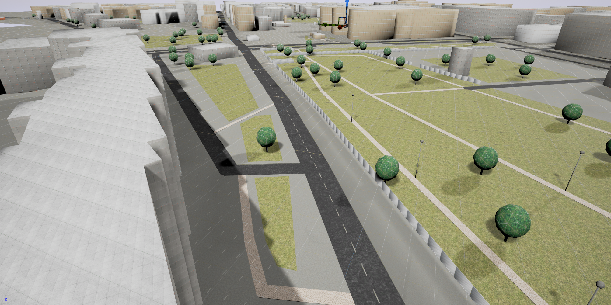

# UtyMapUnreal

## How to use - Quick start
0. Make sure you have my [Utymap fork](https://github.com/RaceTheMaSe/utymap.git) and [RuntimeMeshComponent fork](https://github.com/RaceTheMaSe/UE4RuntimeMeshComponent.git). There are very minor but essential modifications in there
1. Open Source\UtyMapUnreal\UtyMapUnreal.Build.cs and adjust absolute paths to your local setup
2. Right-click .uproject and generate VisualStudio solution. Open it and build as either DevelopmentEditor or DebugGameEditor
3. Load Level UtyMapDemo_Dynamic_Loading, select UtyMapUnrealActor in the World Outliner and adjust paths to your local setup
4. Hit Play button and have fun seeing meshes getting loaded :-)
5. To see errors during load, open the console window.
6. You can fly around the map and it gets loaded underneath you. To load more tiles more quickly, eject player (F8) after hitting "Play", fly away from player, select "default pawn" from World outliner and move him around.

## Current state
The project is in an early state. I am happy to see properly textured meshes and didn't focus on usabilty or proper tile loading yet, which has been altered vastly since I branched. I am not sure how to keep up with the pace. My time is limited on this but I am happy to work together and make the Unreal version clean and robust with your feedback!

## Bigger Todos
- Use Unreals FString where possible to avoid unneccessary conversions from/to std::string
- Async RuntimeMesh branch usage
- Async mesh conversion
- proper tileController
- map and elevation download

Feedback and Pull-requests are very welcome to bring this to a more quality level!

## Notes
- Core library ExportLib.hpp had to be added
- Texture atlas had to be flipped as texture coordinates are differnt between Unity and Unreal. See http://www.aclockworkberry.com/uv-coordinate-systems-3ds-max-unity-unreal-engine/
- RuntimeMesh template for 3 UV channels added

## Previews

